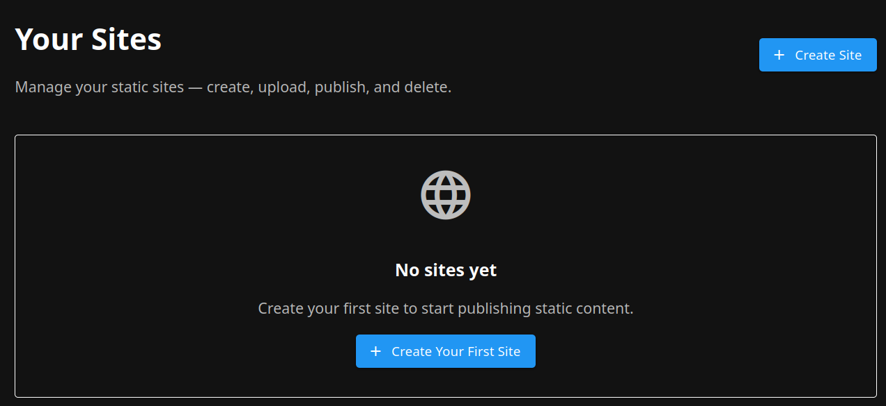
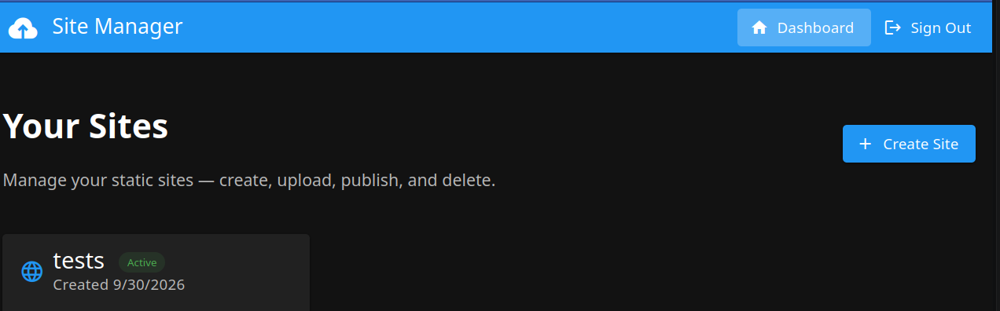

# Self-Service Static Site Hosting on AWS

A prototype platform that lets authenticated users upload and publish static websites through a controlled AWS-hosted gateway — without writing infrastructure as code.

```text
Client → ALB → Cognito auth → ECS NGINX S3 gateway → S3 (private)
                         └──→ Portal (Vue.js) + Backend (Go, serverless)
```

```sh
make deploy
make destroy
```

| Ref1                          | Ref2                          |
| ----------------------------- | ----------------------------- |
|  |  |

## Notes

- Solution had a number of errors produced from the factory
- One ALB certificate cannot cover `<site>.<user>.sites.<zone>`: ACM has no `*.*` wildcard and `*.sites.<zone>` matches one label only (DNS resolves, TLS fails). Only `<site>--<user>.sites.<zone>` is offered.
- experiment; simple static website hosting through the factory
- main difficulties likely caused by factory lacking AWS permissions; unable to directly test deployments / validate flows
- post-fix work much simpler once deployment access existed; deploy; test; adjust
- likely need a reasonable mechanism for factory-driven AWS testing
- primary concern less security; more cost + cleanup + blast radius
- risks; resources left running; forgotten infrastructure; accidental interaction with unrelated systems
- area for exploration; separate executor from factory
  - factory itself gets no AWS permissions
  - factory talks to an external deployment / execution service
  - external service can provision AWS resources on its behalf
  - service enforces lifecycle rules rather than trusting agent behaviour
- executor approach could require every created resource to carry factory-specific ephemeral tags
- tags identify run / experiment ownership; cleanup system can aggressively purge resources after run
- external executor could reject creation where required cleanup tags are absent
- alternative; give factory AWS access directly but enforce very specific provisioning conventions
- require factory-created resources to use mandatory tags before deployment
- tag runs distinctly; allow automated post-run destruction based on those tags
- core requirement either way; experimentation infrastructure needs a reliable garbage-collection boundary
- likely principle; don't depend on AI remembering cleanup; make cleanup and resource ownership structural
